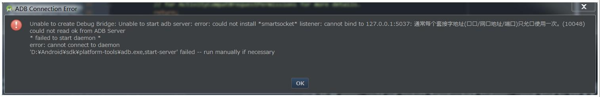

#[adb端口被占用](http://blog.csdn.net/u013277740/article/details/50177895)

###1.输入netstat -ano | findstr "5037"，查看那些程序占用了5037端口

	netstat -ano | findstr "5037"

###2.打开“任务管理器” 在查看选项卡中选中“选择列” 在出现的选择列选项卡中勾选在PID，结束进程就好了 (附：常见占用端口的软件：360手机助手，酷狗音乐)

